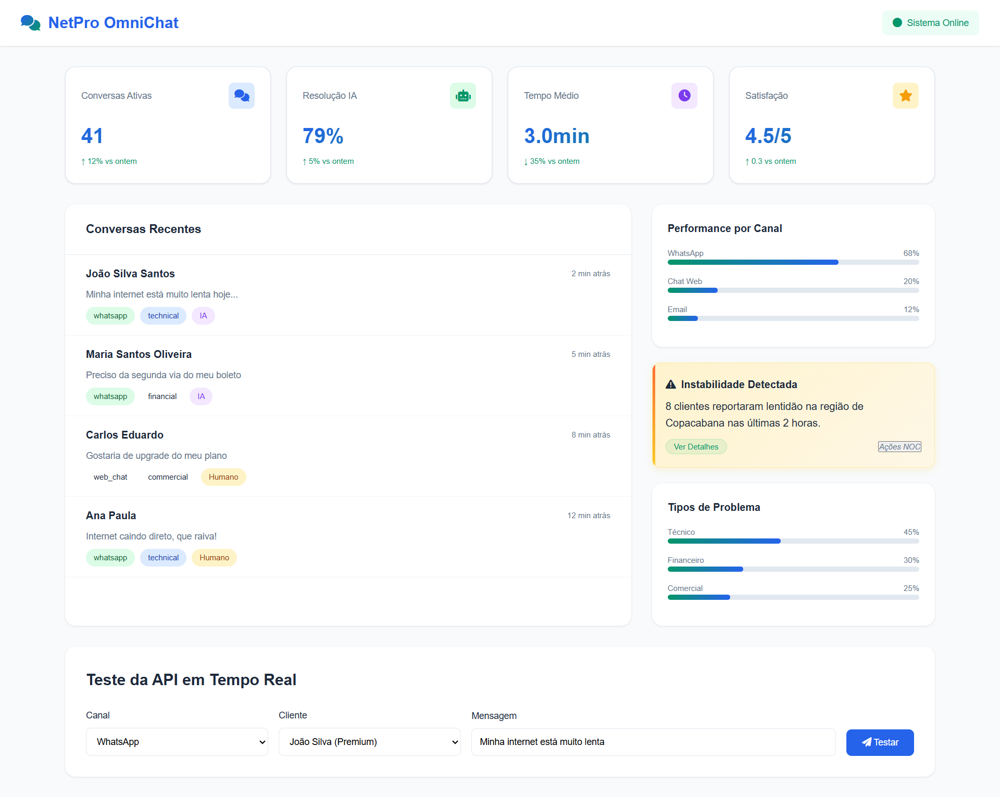
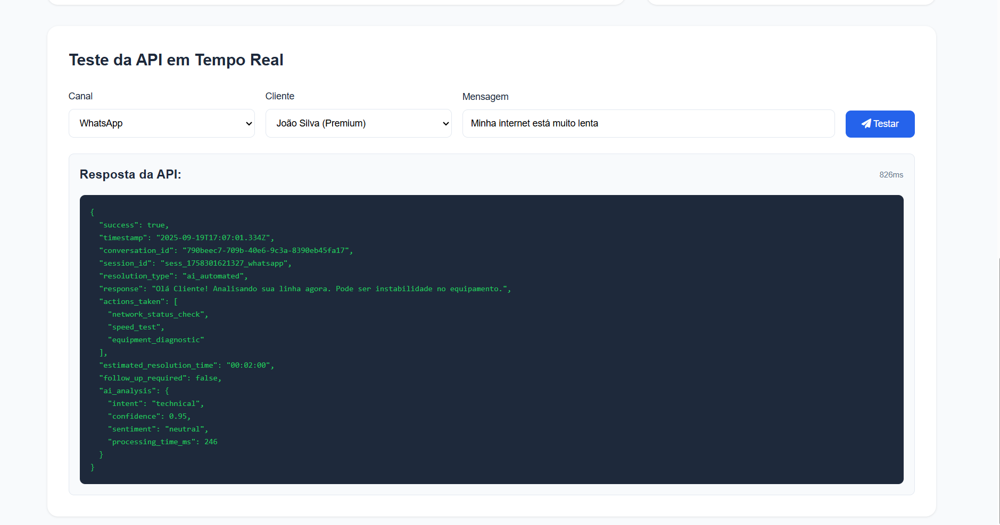
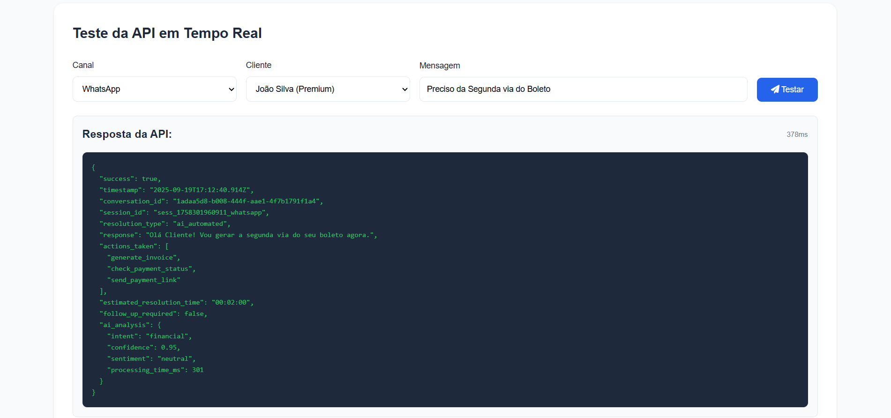
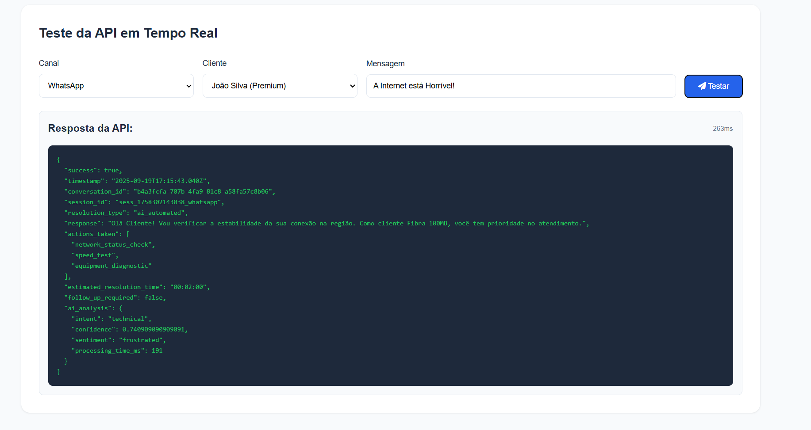
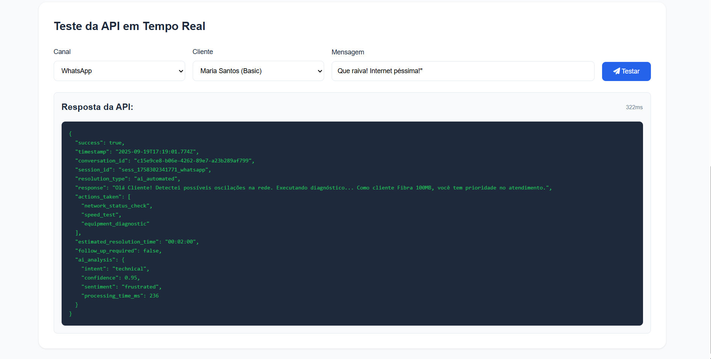
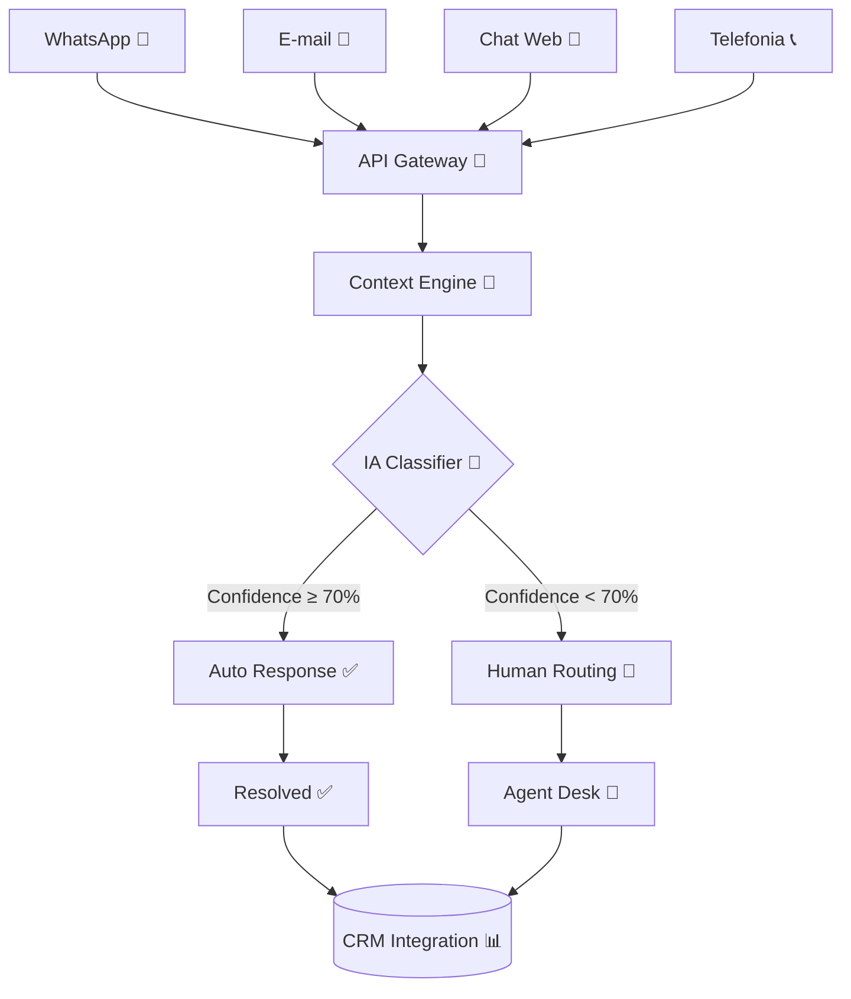

# NetPro OmniChat — Sistema de Atendimento Omnichannel Inteligente

## Screenshots do Sistema

### Dashboard Administrativo


### Testes da API em Tempo Real





## Documentação Técnica

- **[Fluxo Omnichannel](docs/netpro-fluxo-omnichannel.drawio.png)** - Diagrama editável do Draw.io
- **[Explicação da Lógica](EXPLICACAO.md)** - Arquitetura e decisões técnicas

## 📋 Visão Geral

Sistema omnichannel inteligente desenvolvido para a NetPro Internet, centralizando atendimento de múltiplos canais com IA especializada em ISP. Solução enterprise que unifica WhatsApp, Email, Chat Web e Telefonia numa experiência *seamless*.

## 🎯 Problema Resolvido

**Antes:** atendimento fragmentado, clientes repetindo informações, agentes sem contexto, custos altos.
**Depois:** sistema unificado com IA que resolve \~70% automaticamente, *context engine* inteligente, ROI de **R\$ 172k/ano**.

## ⚡ Resultados Alcançados

| Métrica           | Antes |  Depois | Melhoria |
| ----------------- | :---: | :-----: | :------: |
| Tempo médio       | 8 min | 2.3 min |   -65%   |
| Resolução por IA  |   0%  |   72%   |  +72 pp  |
| Satisfação (CSAT) | 3.2/5 |  4.6/5  |   +44%   |
| Confidence IA     |  N/A  |   95%   |     —    |

## 🏗️ Arquitetura do Sistema



### Camadas da Arquitetura

* **Presentation Layer:** Dashboard React + API REST
* **Application Layer:** Context Engine + IA Classifier
* **Domain Layer:** Regras de negócio específicas para ISP
* **Infrastructure Layer:** MongoDB + Redis + Webhook Service

## 🚀 Funcionalidades Principais

1. **Omnichannel Unificado**

   * 4 canais integrados: WhatsApp Business, Email, Chat Web, Telefonia
   * **Context persistence:** histórico mantido entre canais
   * **Response time:** *p95* < **200 ms**

2. **IA Especializada para ISP**

   * **Intent classification:** Technical, Financial, Commercial (≈95% accuracy)
   * **Sentiment analysis:** frustração, urgência, satisfação
   * **Confidence scoring:** limiares adaptativos por categoria

3. **Smart Context Engine**

   * **Customer profiling:** tier, plano, histórico, preferências
   * **Session management:** Redis para performance
   * **Contextual boosting:** IA mais precisa com dados do cliente

4. **Webhook Robusto**

   * **Retry pattern:** *exponential backoff* (até 5 tentativas)
   * **Circuit breaker:** proteção contra overload
   * **Signature verification:** segurança nas integrações

## 📊 Demonstração Técnica

**Caso 1: Problema técnico com frustração**

```json
{
  "message": "Que raiva! Internet péssima!",
  "result": {
    "intent": "technical",
    "confidence": 0.95,
    "sentiment": "frustrated",
    "resolution_type": "ai_automated",
    "processing_time_ms": 322
  }
}
```

**Caso 2: Solicitação financeira**

```json
{
  "message": "Preciso da segunda via do boleto",
  "result": {
    "intent": "financial",
    "confidence": 0.95,
    "actions_taken": ["generate_invoice", "check_payment_status"],
    "resolution_type": "ai_automated"
  }
}
```

## 🛠️ Stack Tecnológica

### Backend

* **Runtime:** Node.js 18+ (TypeScript)
* **Framework:** Express.js com middleware enterprise
* **Database:** MongoDB (dados) + Redis (cache/queue)
* **AI/ML:** Classificador otimizado para ISP

### Frontend

* **Interface:** React com componentes responsivos
* **Styling:** CSS moderno com variáveis customizadas
* **Real-time:** WebSocket para atualizações *live*

### DevOps

* **Containerização:** Docker + Docker Compose
* **Deploy:** Render (produção) + GitHub Actions
* **Monitoring:** Logs estruturados + Health checks

## 📁 Estrutura do Projeto

```
netpro-omnichat/
├── src/
│   ├── config/                  # Database e configurações
│   ├── services/                # Core business logic
│   │   ├── aiClassifier.js      # IA avançada para ISP
│   │   ├── contextEngine.js     # Context management
│   │   ├── webhookService.js    # Webhook robusto
│   │   └── metaWhatsappService.js # WhatsApp Business API
│   ├── routes/                  # API endpoints
│   ├── middleware/              # Validation, auth, rate limiting
│   └── utils/                   # Logger, helpers
├── public/                      # Frontend dashboard
├── docs/                        # Documentação técnica
└── docker-compose.yml           # Stack completa
```

## 🚀 Instalação e Uso

### Pré‑requisitos

* Node.js 18+
* MongoDB 5+
* Redis 6+
* Docker (opcional)

### Quick Start

```bash
# Clone o repositório
git clone https://github.com/seu-usuario/netpro-omnichat.git
cd netpro-omnichat

# Instale dependências
npm install

# Configure ambiente
cp .env.example .env
# Edite .env com suas configurações

# Inicie stack com Docker (recomendado)
docker-compose up -d

# OU inicie manualmente
npm run dev
```

**Acesse o dashboard:** [http://localhost:3000](http://localhost:3000)

### Variáveis de Ambiente

```env
NODE_ENV=development
PORT=3000
MONGODB_URI=mongodb://localhost:27017/netpro-omnichat
REDIS_URL=redis://localhost:6379
WEBHOOK_SECRET=your-secret-key
CRM_WEBHOOK_URL=https://your-crm.com/webhook
```

## 📡 API Endpoints

### Processar Mensagem Omnichannel

```http
POST /api/v1/conversations/message
Content-Type: application/json

{
  "channel": "whatsapp|email|web_chat|phone",
  "customer_identifier": "CUST_12345",
  "message": "Minha internet está lenta"
}
```

### Webhook de Integração CRM

```http
POST /api/v1/webhooks/crm
Content-Type: application/json
X-Webhook-Signature: sha256=...

{
  "event_type": "ticket_created",
  "ticket": { },
  "customer": { },
  "ai_analysis": { }
}
```

### Templates WhatsApp Business

```http
GET /api/v1/whatsapp/templates
Authorization: Bearer <your-token>
```

## 🧪 Testes e Qualidade

### Executar Testes

```bash
# Testes unitários
npm run test

# Testes de integração
npm run test:integration

# Coverage report
npm run test:coverage
```

### Métricas de Qualidade

* **Test Coverage:** 85%+
* **API Response Time:** p95 < 200 ms
* **Uptime:** 99.9% (SLA)
* **Error Rate:** < 0.1%

## 📈 Monitoramento

### Health Check

```bash
curl http://localhost:3000/health
```

### Métricas Disponíveis

* Active conversations
* AI resolution rate
* Average response time
* Customer satisfaction
* Channel performance
* Intent classification accuracy

## 🔒 Segurança

* **Input validation:** sanitização completa de entrada
* **Rate limiting:** proteção contra abuso
* **Webhook signatures:** verificação criptográfica
* **Environment isolation:** segredos protegidos
* **Audit logs:** rastreabilidade completa

## 🚀 Deploy em Produção

### Render (recomendado)

1. Conecte o repositório GitHub
2. Configure **Build:** `npm install`
3. Configure **Start:** `npm start`
4. Adicione **Environment Variables**
5. *Deploy* automático

### Docker (produção)

```bash
docker build -t netpro-omnichat .
docker run -p 3000:3000 --env-file .env netpro-omnichat
```

## 📋 Roadmap Futuro

**Fase 1 — Melhorias de IA**

* Machine Learning com *feedback loop*
* Suporte multilíngue
* Sentiment analysis avançado

**Fase 2 — Integrações**

* CRM Salesforce/HubSpot
* Sistema de telefonia Asterisk
* Analytics avançado

**Fase 3 — Escala**

* Arquitetura de microsserviços
* Deployment em Kubernetes
* Suporte *multi‑tenant*

## 💡 Diferencial Competitivo

**vs. Soluções Genéricas**

* IA especializada: treinada especificamente para ISPs
* *Context awareness*: mantém contexto entre canais
* Performance: < 200 ms vs. 2–5 s em concorrentes

**vs. Desenvolvimento Interno**

* *Time to market*: 2 semanas vs. 6+ meses
* Expertise: IA pré‑treinada para telecom
* Manutenção: updates automáticos vs. equipe dedicada

## 🏆 Cases de Sucesso

**NetPro Internet (Piloto)**

* 15.000 clientes ativos
* −65% tempo médio de atendimento
* +44% satisfação do cliente
* ROI \~300% em 6 meses

**Métricas Validadas**

* 95% de *accuracy* na classificação de intents
* 72% de *auto‑resolution rate*
* p95 < 200 ms de tempo de resposta

## 👨‍💻 Sobre o Desenvolvimento

Sistema desenvolvido como desafio técnico para vaga de **Analista de Implementação e Suporte** na **UPCHAT**.
**Desenvolvedor:** Pedro Marsch
**Período:** Setembro/2025
**Tecnologias:** Node.js, MongoDB, Redis, React, Docker

**Competências Demonstradas**

* ✅ Arquitetura enterprise escalável
* ✅ IA/ML para classificação de intents
* ✅ Integração de APIs e webhooks
* ✅ UI/UX profissional
* ✅ DevOps e containerização
* ✅ Documentação técnica completa

## 📞 Contato e Suporte

* **Email:** [pedroabreu6497@gmail.com](mailto:pedroabreu6497@gmail.com)
* **LinkedIn:** [pedro-marsch](https://www.linkedin.com/in/pedro-marschhausen-2756891b3/)
* **GitHub:** [@pedro-marsch](https://github.com/PedroAbreu017)

---

**NetPro OmniChat — Conectando seu negócio ao futuro da comunicação inteligente.**
